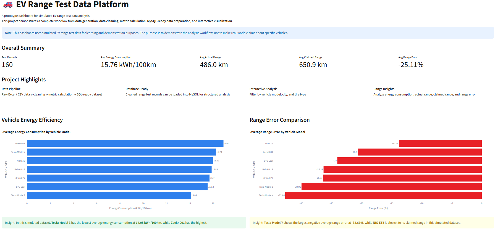
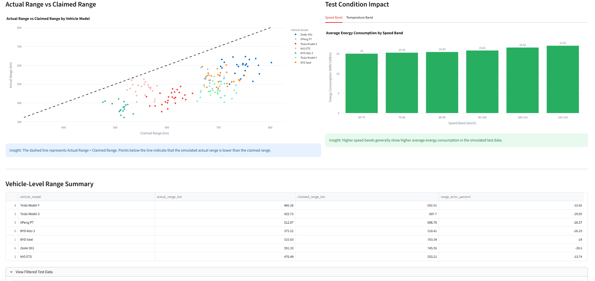

# EV Range Test Data Platform

## Project Overview

This project is a prototype EV range test data platform built for learning and portfolio demonstration purposes.

It simulates a vehicle range testing data workflow, including raw data generation, data cleaning, metric calculation, exploratory data analysis, MySQL database preparation, SQL analysis, and interactive dashboard visualization.

The project is inspired by real EV range testing workflows, where engineers need to collect test records, clean measurement data, calculate key range and energy metrics, store structured data in a database, and visualize results for engineering analysis.

> Note: This project uses simulated EV range test data. It does not represent real-world vehicle performance or official data from any vehicle manufacturer.

---

## Technologies Used

- Python
- Pandas
- NumPy
- Matplotlib
- MySQL
- SQLAlchemy
- PyMySQL
- Streamlit
- Plotly
- Excel / CSV

---

## Project Workflow

```text
Raw simulated EV test data
        ↓
Data cleaning and validation
        ↓
Metric calculation
        ↓
Exploratory data analysis
        ↓
MySQL database loading
        ↓
SQL analysis
        ↓
Interactive Streamlit dashboard
```

---

## Step 1: Sample Data Generation

In this step, I generated a simulated EV range test dataset using Python.

The dataset includes fields such as:

- Test ID
- Vehicle model
- Test date
- City
- Temperature
- Tire type
- Test speed
- Battery capacity
- Start SOC
- End SOC
- Distance travelled
- Energy used
- Energy consumption
- Claimed range
- Actual range
- Range error percentage

The simulated data was designed with simple engineering assumptions:

- Different vehicle models have different base battery capacities and base energy consumption levels.
- Higher test speeds generally increase energy consumption.
- Low-temperature conditions increase energy consumption.
- Actual range is calculated based on battery capacity and energy consumption.
- Claimed range is treated as a more optimistic reference value.

### Script

- `scripts/generate_sample_data.py`

### Output

- `data/raw/range_test_raw.xlsx`

---

## Step 2: Data Cleaning

In this step, I cleaned the raw simulated Excel dataset using Python and Pandas.

### Cleaning Tasks

- Loaded raw Excel data using Pandas.
- Checked dataset shape and missing values.
- Converted `test_date` into datetime format.
- Filled missing numerical values using median imputation.
- Filled missing categorical values with `"Unknown"`.
- Removed duplicate records based on `test_id`.
- Recalculated key metrics including SOC used, energy consumption, and range error percentage.
- Exported cleaned data as CSV.

### Script

- `scripts/clean_range_data.py`

### Output

- `data/clean/range_test_clean.csv`

---

## Step 3: Exploratory Data Analysis

After cleaning the simulated EV range test dataset, I performed exploratory data analysis using Python, Pandas, and Matplotlib.

### Analysis Tasks

- Compared average energy consumption across vehicle models.
- Compared actual range and claimed range using an `Actual = Claimed` reference line.
- Grouped test speed into speed bands and analyzed average energy consumption.
- Grouped temperature into temperature bands and analyzed average energy consumption.
- Exported summary charts for dashboard development and project documentation.

### Main Output Charts

- `outputs/avg_consumption_by_model_barh.png`
- `outputs/actual_vs_claimed_range_by_model.png`
- `outputs/avg_consumption_by_speed_band.png`
- `outputs/avg_consumption_by_temperature_band.png`

### Key Findings from Simulated Data

- Average energy consumption differs across vehicle models.
- Most simulated actual range values are lower than claimed range values.
- Higher test speed bands show higher average energy consumption.
- Low-temperature conditions show higher average energy consumption.

---

## Step 4: MySQL Database and SQL Analysis

In this step, I created a MySQL database to store the cleaned EV range test dataset and used SQL queries to reproduce the key analysis results.

### Database Setup

- Created a MySQL database: `ev_range_test_db`
- Created a main table: `range_tests`
- Imported the cleaned CSV dataset into MySQL using Python, Pandas, SQLAlchemy, and PyMySQL.
- Verified that 160 cleaned test records were successfully inserted into the database.

### Table: `range_tests`

The table stores one row per simulated EV range test record, including:

- Vehicle model
- Test date and city
- Temperature and tire type
- Test speed
- Battery capacity
- Start and end SOC
- Distance travelled
- Energy used
- Energy consumption
- Claimed range
- Actual range
- Range error percentage

### SQL Analysis Tasks

- Counted total records in the database.
- Calculated test record count by vehicle model.
- Compared average energy consumption by vehicle model.
- Compared actual range and claimed range by vehicle model.
- Grouped test speed into speed bands and calculated average energy consumption.
- Grouped temperature into temperature bands and calculated average energy consumption.
- Identified the top 10 highest energy consumption test records.

### Key SQL Findings from Simulated Data

- The database contains 160 cleaned EV range test records.
- Tesla Model 3 shows the lowest average energy consumption in this simulated dataset.
- Zeekr 001 shows the highest average energy consumption in this simulated dataset.
- Higher speed bands show higher average energy consumption.
- Low-temperature conditions show higher average energy consumption.

### SQL Files

- `sql/create_tables.sql`
- `sql/analysis_queries.sql`

### Python Database Loading Script

- `scripts/load_to_mysql.py`

---

## Step 5: Interactive Streamlit Dashboard

In this step, I built an interactive dashboard using Streamlit and Plotly to visualize the cleaned EV range test dataset.

### Dashboard Features

- Sidebar filters for vehicle model, city, and tire type.
- KPI cards for total test records, average energy consumption, average actual range, average claimed range, and average range error.
- Vehicle-level energy efficiency comparison.
- Average range error comparison by vehicle model.
- Actual range vs claimed range scatter plot with an `Actual = Claimed` reference line.
- Speed-band and temperature-band energy consumption analysis.
- Vehicle-level range summary table.
- Interactive filtered test data table.

### Dashboard File

- `dashboard/app.py`

### Streamlit Theme Configuration

- `.streamlit/config.toml`

The dashboard uses a light theme to make screenshots and project presentation clearer.

### Note

This dashboard uses simulated EV range test data for learning and demonstration purposes. It does not represent real-world vehicle performance.

---

## Key Metrics

### Energy Consumption

Energy consumption is calculated as:

```text
energy_consumption_kwh_100km = energy_used_kwh / distance_km * 100
```

This measures how many kilowatt-hours of energy are consumed per 100 km.

### SOC Used

```text
soc_used_percent = start_soc_percent - end_soc_percent
```

This measures how much battery SOC was used during the test.

### Range Error Percentage

```text
range_error_percent = (actual_range_km - claimed_range_km) / claimed_range_km * 100
```

This measures how far the simulated actual range differs from the claimed range.

If the value is negative, the actual range is lower than the claimed range.

---

## Dashboard Preview

### Dashboard Overview



### Dashboard Analysis View



> If the image files are not available, run the Streamlit dashboard locally using the instructions below.

---

## Project Structure

```text
EV_range_Test_Platform/
├── data/
│   ├── raw/
│   │   └── range_test_raw.xlsx
│   └── clean/
│       └── range_test_clean.csv
├── scripts/
│   ├── generate_sample_data.py
│   ├── clean_range_data.py
│   ├── analyze_range_data.py
│   └── load_to_mysql.py
├── sql/
│   ├── create_tables.sql
│   └── analysis_queries.sql
├── outputs/
│   ├── avg_consumption_by_model_barh.png
│   ├── actual_vs_claimed_range_by_model.png
│   ├── avg_consumption_by_speed_band.png
│   ├── avg_consumption_by_temperature_band.png
│   ├── dashboard_overview.png
│   └── dashboard_analysis.png
├── dashboard/
│   └── app.py
├── .streamlit/
│   └── config.toml
├── requirements.txt
└── README.md
```

---

## How to Run

### 1. Install Dependencies

```bash
pip install -r requirements.txt
```

### 2. Generate Sample Data

```bash
python scripts/generate_sample_data.py
```

### 3. Clean Data

```bash
python scripts/clean_range_data.py
```

### 4. Run Exploratory Analysis

```bash
python scripts/analyze_range_data.py
```

### 5. Create MySQL Database and Tables

```bash
mysql -u root -p < sql/create_tables.sql
```

On Windows PowerShell, if input redirection using `<` is not supported, run this command in CMD instead.

### 6. Load Cleaned Data into MySQL

Before running this step, update the MySQL password inside:

```text
scripts/load_to_mysql.py
```

Then run:

```bash
python scripts/load_to_mysql.py
```

### 7. Run SQL Analysis

```bash
mysql -u root -p < sql/analysis_queries.sql
```

### 8. Launch Streamlit Dashboard

```bash
python -m streamlit run dashboard/app.py
```

The dashboard will open in your browser at:

```text
http://localhost:8501
```

---

## Requirements

Create a `requirements.txt` file with:

```text
pandas
numpy
openpyxl
matplotlib
sqlalchemy
pymysql
streamlit
plotly
```

---

## Important Notes

This project uses simulated data only.

The analysis results should not be interpreted as real-world performance comparisons between vehicle models. The purpose of this project is to demonstrate:

- Data generation
- Data cleaning
- Metric calculation
- SQL-ready data preparation
- MySQL loading
- SQL analysis
- Interactive dashboard development
- EV range testing style analysis workflow

---

## Future Work

- Add a CAN-style Ok-To-Go monitoring prototype using simulated vehicle signals.
- Add more advanced validation rules for EV range test records.
- Build an optional Power BI dashboard version.
- Improve database normalization by separating vehicle information, test sessions, test conditions, and range results into multiple tables.
- Add automated report export for test summaries.
- Add more detailed test scenario simulation, such as road type, HVAC usage, payload, and driving mode.

---

## Project Purpose

This project was created as a portfolio project to demonstrate practical skills in Python, SQL, MySQL, data analysis, and dashboard development for vehicle testing data workflows.

It is suitable for demonstrating interest and capability in roles related to:

- Data analytics
- Vehicle testing data analysis
- EV range testing
- Engineering data platforms
- Dashboard development
- MySQL database preparation